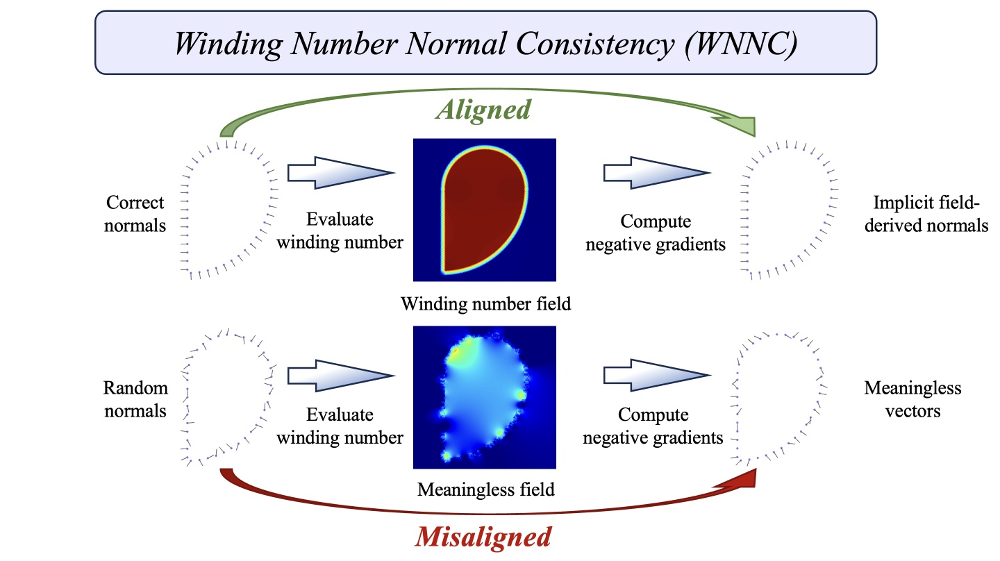

# Winding Number Normal Consistency (WNNC)

This repository contains the official implementation of the paper

**Fast and Globally Consistent Normal Orientation based on the Winding Number Normal Consistency**

**ACM ToG 2024, SIGGRAPH Asia 2024 Journal Track**

**[Siyou Lin](https://jsnln.github.io/), [Zuoqiang Shi](https://shizqi.github.io/), [Yebin Liu](http://liuyebin.com/)**

[Project page](https://jsnln.github.io/wnnc/index.html) | [Paper](https://arxiv.org/abs/2405.16634)



### Features

1. A PyTorch extension for accelerating winding numbers in `ext/wn_treecode`
2. A fast iterative method for normal estimation: `main_wnnc.py`
3. As a by-product, we provide *unofficial* CPU and CUDA implementations for [Gauss surface reconstruction](https://dl.acm.org/doi/10.1145/3233984) in `ext/gaussrecon_src`, which is faster than [PoissonRecon](https://github.com/mkazhdan/PoissonRecon) with better smoothness control, but never officially open-sourced.

### Usage

1. For WNNC normal estimation:
```bash
cd ext
pip install -e .
cd ..

# width is important for normal quality, we provide a few presets through --width_config

# for clean uniform samples, use l0
python main_wnnc.py data/Armadillo_40000.xyz --width_config l0 --tqdm

# for noisy points, non-uniform distribution, use l1 (small noise) ~ l5 (large noise) depending on the noise level
# the higher the noise level, the smoother the normals
python main_wnnc.py data/bunny_noised.xyz --width_config l1 --tqdm
...
python main_wnnc.py data/bunny_noised.xyz --width_config l5 --tqdm

# the user can also use custom widths:
python main_wnnc.py data/bunny_noised.xyz --width_config custom --wsmin 0.03 --wsmax 0.12 --tqdm

# to see a complete list of options:
python main_wnnc.py -h
```

2. For Gauss surface reconstruction:
First download [ANN 1.1.2](https://www.cs.umd.edu/~mount/ANN/) and unpack to `ext/gaussrecon_src/ANN`. Run `make` there. Then go back to the main repository directory, and:
```bash
sh build_cpu.sh
sh build_cuda.sh

./main_GaussReconCPU -i <input.xyz> -o <output.ply>
./main_GaussReconCUDA -i <input.xyz> -o <output.ply>
```

### TODO

This is a preliminary version and updates are coming soon

- [ ] More detailed instructions and documentation.
- [ ] Test data samples
- [ ] Code cleaning
